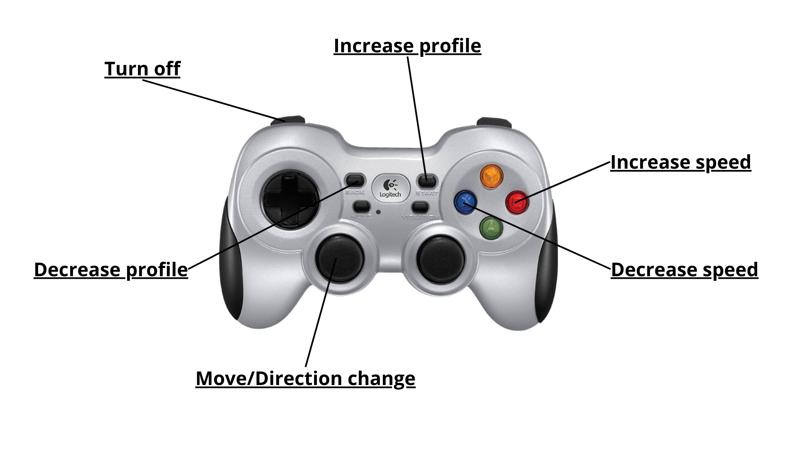

# CAN to R-Net control Project

## Inspiration
This project was inspired by the work done in [can2RNET](https://github.com/redragonx/can2RNET)

## Overview
This project provides an interface for CAN bus communication and rnet electronics wheelchair, allowing to control a rnet wheelchair with an xbox like controller.

## Features
- Can interface 
- Real-time CAN frames processing
- Support for standard CAN protocols
- Easy-to-use interface for sending and receiving CAN messages in string format

## Communication library
The entire CAN and R-Net communication is handled by two cpp classes (ControllerHandler and CANHandler) that are completely independent from ROS. So if you want to use this library in another project, you can do so by just using these two classes. The WheelchairController class is the main class that handles the ROS interface and is used to receive data from the controller through the joy node.

## Hardware Requirements
- Raspberry Pi (3B+ or 4 recommended)
- USB-to-CAN adapter (such as CANable, PCAN-USB, or similar CAN interface)
- CAN devices for communication
- Xbox like controller

## Software Requirements
- Ubuntu 20.04
- ROS Noetic
- can-utils package
- roscpp

## Installation

### 1. ROS Noetic
Ensure Ubuntu and ROS Noetic are installed on the pi. If not, follow the [official ROS installation guide](http://wiki.ros.org/noetic/Installation/Ubuntu).

### 2. CAN Utils
Install the can-utils package:

```bash
sudo apt-get update
sudo apt-get install can-utils
```

### 3. Clone this repository
```bash
cd ~/catkin_ws/src
git clone https://github.com/Martinioini/SmartWheelchair.git
cd ~/catkin_ws
catkin_make
```

## CAN Interface Setup

### 1. R-Net Wiring Pinout to CAN interface
Strip a R-Net wire in half.
Connect the wire with this pinout:
- White is CAN High
- Blue is CAN Low
- Black is GND
- Red is +Vin

### 2. Configure CAN interface
Set up the CAN interface with the correct bitrate (125000 in my case):

```bash
sudo ip link set can0 type can bitrate 125000
sudo ip link set up can0
```


### 3. Test CAN communication
You can test if your CAN interface is working properly using can-utils:

```bash
# Listen for CAN messages
candump can0

# Send a test message
cansend can0 123#DEADBEEF
```

## Usage

1. Source the setup script:
```bash
source ~/catkin_ws/devel/setup.bash
```

2. Launch the CAN interface node:
```bash
roslaunch wheelchair_control real_wheelchair.launch 
```

## ROS nodes structure


## Real time speed processing
The program is able to get the speed of the wheelchair runtime, they are calculated using the parameters set on the profiles in the wheelchair configuration, the current speed level set on the JSM module and how much the stick of the controller is tilted. if you want you can control the movement of the wheelchair by just publishing cmd_vel commands to the wheelchair.
Note: if you want to have a precise value for your wheelchair you will need to match the parameters yaml file to the ones on the wheelchair. you will also need to test the max values of speed to correctly adjust the speed map in the joy_utility file. To do this set the max forward speed in the jsm module to 5, set the max speed in movement mode and manually test the speed. Increase by 5 the max forward speed and repeat until you have reached 100, tracking down the values in km/h and converting them to m/s. If you don't adjust the values the functioning of the joystick control will still work without any issues but the values reported in the output will not be accurate.

## Controller Layout
Below is the layout of the controller used for wheelchair control:



## Troubleshooting
- If the CAN interface doesn't come up, check your hardware connections
- Verify that your USB-to-CAN adapter is properly recognized with `dmesg | grep can`
- Ensure the correct bitrate is set for your CAN network

## Contributing
Contributions are welcome! Please feel free to submit a Pull Request.
